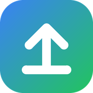
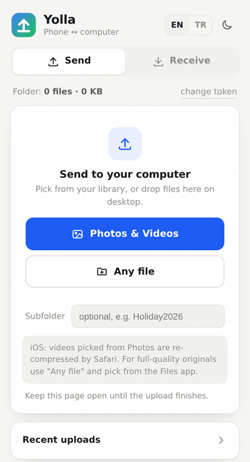
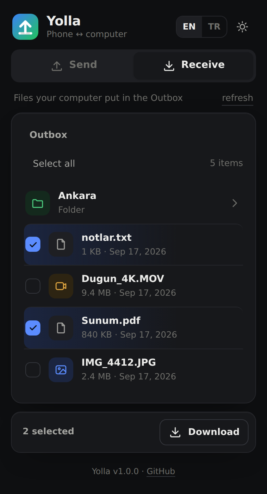

<p align="center"></p>
<h1 align="center">Yolla</h1>
<p align="center">Telefonundaki fotoğraf, video ve dosyaları kendi bilgisayarındaki bir klasöre yolla.<br>Telefona kurulum yok, bulut yok, hesap yok.</p>

<p align="center">
  <a href="LICENSE"></a>
  
  
  <a href="README.md"></a>
</p>

<p align="center">&nbsp;&nbsp;</p>

## Bu ne

Yolla, dosya alan küçük bir web sayfası. Dosyaların gelmesini istediğin bilgisayarda çalıştırıyorsun (Windows PC, Mac, Linux, NAS, Raspberry Pi fark etmez), telefondan adresini açıyorsun, **Fotoğraf & Video**'ya basıp istediğin kadar seçiyorsun, dosyalar o bilgisayardaki sıradan bir klasöre düşüyor. Tersi de var: bilgisayarda Giden Kutusu klasörüne attığın dosyaları telefondan alıyorsun. Önüne bir tünel ya da kendi alan adını koyarsan sadece evde değil, her yerden çalışıyor.

Bunu yazdım çünkü iPhone'daki birkaç yüz tatil fotoğrafını Windows'a atmak hâlâ eziyet. iCloud for Windows olmadık yerde bozuluyor, AirDrop sadece Apple'la konuşuyor, her aktarım uygulaması da iki cihaza da kurulmak ve aynı Wi‑Fi'da olmak istiyor. Ben tam tersini istedim: bir konteyner, bir sayfa, benim klasörüm. Projenin tamamı bağımlılıksız bir C# dosyası ve bir HTML dosyası; bir akşamda okuyup sonra unutabilirsin.

## Neden Yolla

Dosya taşımanın bir sürü yolu var. Burada farklı olan şu:

- **Telefona hiçbir şey kurmuyorsun.** Bir adres açıyorsun. iPhone, Android, eşinin telefonu, arkadaşının laptopu, tarayıcısı olan her şey.
- **Öğrenecek bir şey yok.** Tek sayfa, iki buton. Hesap yok, kütüphane yok, ayar ekranı yok, ayar dosyası yok.
- **Dosyalar klasöre düşüyor.** Kendi bilgisayarındaki normal bir klasöre. Buluta değil, bir uygulamanın kendi veritabanına değil. Explorer'da ya da Finder'da her klasör gibi açıyorsun.
- **Her yerden çalışıyor.** Ücretsiz bir tünelle aynı adres ofisten, otelden, başka ülkeden de çalışır.
- **Kalabalık için yapıldı.** 400 fotoğraf seç, telefonu bırak. Bağlantı koparsa tekrar seç; kaldığı yerden devam eder, aynı fotoğrafı iki kez yüklemez.
- **Yüklediklerin geri okunamaz.** Telefonun görebildiği tek klasör, bilerek doldurduğun Giden Kutusu. Yüklediğin her şey sadece-yazma; linki bulan biri fotoğraflarına göz atamaz, şifre koyduysan yükleyemez de.
- **Okuyabileceğin kadar küçük.** İki dosya, bağımlılık yok, telemetri yok, ağının dışına giden hiçbir istek yok.
- **Ücretsiz.** MIT lisansı. Windows, macOS ve Linux'ta tek satırla kurulur; Pi'de, NAS'ta çalışır.

Genelde başvurulan araçlarla karşılaştırınca:

| | Yolla | LocalSend | PairDrop | copyparty | Immich / Nextcloud |
|---|:-:|:-:|:-:|:-:|:-:|
| Telefona kurulum gerekmez | ✅ | ❌ iki cihaza da uygulama | ✅ | ✅ | ❌ uygulama |
| Evin dışından çalışır | ✅ | ❌ sadece aynı Wi‑Fi | ~ iki sayfa da açık olmalı | ✅ | ✅ |
| Dosyalar normal bir klasöre düşer | ✅ | ✅ | ~ tarayıcı indirmeleri, ZIP | ✅ | ❌ kendi kütüphanesi |
| Öğrenecek / ayarlayacak bir şey yok | ✅ | ✅ | ✅ | ❌ yüzlerce seçenek | ❌ |
| Kopan 400 dosyalık yüklemeye devam eder | ✅ | ❌ | ❌ | ✅ | ✅ |
| Yüklenenler geri okunamaz | ✅ | – | – | ~ isteğe bağlı | ❌ |

<sub>Eylül 2026 itibarıyla, bildiğim kadarıyla. Sevdiğin araç hakkında yanlış bir şey yazdıysam issue aç, düzelteyim.</sub>

Ne zaman başka bir şey kullanmalısın: dosyalarına telefondan göz atıp indirmek de istiyorsan, küçük resim, WebDAV ve medya oynatıcıyla, [copyparty](https://github.com/9001/copyparty) bunların hepsini ve çok daha fazlasını yapıyor. Yüz tanımalı, telefondan otomatik yedekleyen gerçek bir fotoğraf kütüphanesi istiyorsan o [Immich](https://immich.app). İki cihaz hep aynı Wi‑Fi'daysa ve uygulama kurmak dert değilse [LocalSend](https://localsend.org) çok iyi. Yolla tek bir şey istediğin an için: şu dosyalar bilgisayarıma geçsin, hemen, hiçbir şey ayarlamadan.

## Ne yapıyor

- Aynı anda üç dosya yüklüyor, hata olursa tekrar deniyor; ilerlemeyi, hızı ve kalan süreyi gösteriyor.
- Her dosyayı 32 MB'lık parçalar halinde diske akıtıyor. Kopan bağlantı en fazla bir parçaya mal oluyor; aynı dosyaları tekrar seçince tam kaldığı bayttan devam ediyor.
- Asla üzerine yazmıyor. Aynı isim ve aynı boyut kopya sayılıp atlanıyor; aynı isimde farklı bir dosya `IMG_0001 (1).JPG` oluyor.
- Fotoğrafın çekim tarihini dosya tarihi yapıyor, klasör çekim tarihine göre sıralanıyor. İstersen `YYYY/YYYY-AA/` alt klasörleri.
- **Al** sekmesi: bilgisayarda `Outbox` klasörüne koyduğun dosyalar telefonda görünüyor. Tek dosya indir, birkaçını ZIP olarak al, ya da iPhone'da *Fotoğraflara Kaydet* de, doğrudan galeriye insin.
- Her tarayıcıda çalışıyor. Masaüstünde sürükle-bırak ve yapıştır var. İkinci buton medya dışı dosyaları alıyor. Açık ve koyu tema, Türkçe ve İngilizce. iPhone'da *Ana Ekrana Ekle* deyince uygulama ikonu oluyor.
- İsteğe bağlı erişim şifresi, boyut sınırı ve her yükleme için alt klasör.
- Cloudflare Tunnel, ngrok, kendi reverse proxy'n (alt yolda bile) ya da düz yerel ağ, hepsinin arkasında çalışıyor. Parçalar Cloudflare'in 100 MB istek sınırının altında kalıyor.

## Kurulum

### Önce karar verilecek üç şey

Kurulum betiği soru sormuyor. Varsayılanlarla kuruyor; sonradan bir şeyi değiştirmek istersen betiği tekrar çalıştırıyorsun. Yine de ne ayarladığını bilmek iyi:

1. **Klasör.** Yüklemelerin bu bilgisayarda gideceği yer. Varsayılan, ev klasöründeki `Pictures/Yolla`. Herhangi bir klasör olur; yoksa oluşturulur.
2. **Erişim şifresi.** Bir parola. Telefon bir kez soruyor, sonra hatırlıyor. Şifre yoksa adresi bulan herkes diskine dosya atabilir; Yolla Wi‑Fi'ının dışına hiç çıkmayacaksa bile bir tane olsun. Seçmezsen betik rastgele bir tane üretip gösteriyor.
3. **Tünel.** Sadece Yolla'ya Wi‑Fi'ının dışından erişmek için lazım. `quick`, hesap açmadan rastgele bir Cloudflare adresi veriyor (her yeniden başlatmada değişiyor). `cloudflare` (kendi alan adında kalıcı adres) ve `ngrok` o servislerden alınan bir token istiyor; bkz. [Her yerden erişim](#her-yerden-erişim). Evde deneme yaparken bunu atla.

Docker lazım: Windows ve macOS'ta [Docker Desktop](https://docker.com/products/docker-desktop). Linux'ta betik kurmayı teklif ediyor, sen onaylıyorsun.

### Tek satır

Varsayılanlar: klasör `Pictures/Yolla`, üretilen şifre, tünel yok.

Windows (PowerShell):

```powershell
irm https://raw.githubusercontent.com/TekyaygilFethi/yolla/main/scripts/install.ps1 | iex
```

macOS / Linux:

```bash
curl -fsSL https://raw.githubusercontent.com/TekyaygilFethi/yolla/main/scripts/install.sh | bash
```

Betik Docker'a bakıyor, ayar dosyasını yazıyor, imajı çekiyor, Yolla'yı başlatıyor; bu bilgisayardaki adresi, Wi‑Fi'daki adresi ve şifreyi ekrana basıyor.

Bir betiği doğrudan shell'e akıtmak hoşuna gitmiyorsa haklısın. İndir, oku (200 satır civarı), sonra çalıştır:

```bash
curl -fsSLO https://raw.githubusercontent.com/TekyaygilFethi/yolla/main/scripts/install.sh && less install.sh && bash install.sh
```

### Parametreli

Aynı şey, üç ayarı kendin seçerek. Burada: `D:` üzerinde bir klasör, kendi şifren ve hemen her yerden çalışsın diye hızlı tünel.

```powershell
# Windows
& ([scriptblock]::Create((irm https://raw.githubusercontent.com/TekyaygilFethi/yolla/main/scripts/install.ps1))) -Dir "D:\Fotolar\Yolla" -Token "gizli" -Tunnel quick
```
```bash
# macOS / Linux
curl -fsSL https://raw.githubusercontent.com/TekyaygilFethi/yolla/main/scripts/install.sh | bash -s -- --dir ~/Pictures/Yolla --token gizli --tunnel quick
```

Fikrin değişti mi? Başka parametrelerle tekrar çalıştır, mesela mevcut kuruluma `--tunnel quick` ekle. Tekrar vermediğin her şey olduğu gibi kalıyor.

| Parametre (sh / ps1) | Ne yapıyor |
|---|---|
| `--dir` / `-Dir` | Dosyaların düşeceği klasör. Varsayılan `~/Pictures/Yolla`. |
| `--token` / `-Token` | Erişim şifresi. Vermezsen üretiliyor. `--no-token` / `-NoToken` kapatıyor (lütfen sadece yerel ağda). |
| `--port` / `-Port` | Bu makinedeki port. Varsayılan `8080`. |
| `--tunnel` / `-Tunnel` | `quick`, `cloudflare` (+ `--cf-token`), `ngrok` (+ `--ngrok-token`, istersen `--ngrok-domain`) ya da `none`. |
| `--group-by-date` / `-GroupByDate` | Fotoğraf tarihine göre `YYYY/YYYY-AA/` altına kaydet. |
| `--max-mb` / `-MaxMb` | Bundan büyük tek dosyaları reddet. Varsayılan 0 = sınır yok. |
| `--no-outbox` / `-NoOutbox` | Al sekmesini kapat; telefondan hiçbir şey okunamasın. |
| `--update`, `--status`, `--uninstall` / `-Update`, `-Status`, `-Uninstall` | Bakım. Kaldırma dosyalarına dokunmuyor. |

Betik `~/.yolla/` altına (Windows'ta `%LOCALAPPDATA%\Yolla\`) bir `.env` ve bir `docker-compose.yml` yazıyor. İstersen elle düzenle; `--update` uygular.

### Elle

```bash
docker run -d --name yolla --restart unless-stopped -p 8080:8080 \
  -v "/klasor/yolu:/data" -e UPLOAD_TOKEN=gizli \
  ghcr.io/tekyaygilfethi/yolla:latest
```

Windows yolları `/` ile: `-v "C:/Users/sen/Pictures/Yolla:/data"`. Konteyner 1000 numaralı kullanıcı olarak çalışıyor; Linux'ta klasörün başka bir kullanıcıya aitse `--user "$(id -u):$(id -g)"` ekle. Compose için: `git clone`, `cp .env.example .env`, düzenle, `docker compose up -d`. Docker yok mu? [.NET 10 SDK](https://dotnet.microsoft.com/download) ile: `cd src/Yolla && UPLOAD_DIR=/yol UPLOAD_TOKEN=gizli dotnet run -c Release`.

## Kullanım

1. Bilgisayarda: <http://localhost:8080>. Aynı Wi‑Fi'daki telefondan: `http://<bilgisayar-ip>:8080` (betik yazıyor). Tünel yok, en hızlı yol bu.
2. İlk açılışta şifre soruyor, o cihazda hatırlıyor. Sonradan başka bir şifre girmek istersen klasör bilgisinin yanındaki *şifreyi değiştir*'e bas.
3. **Fotoğraf & Video** telefonun fotoğraf seçicisini açıyor. Seç, yükleme hemen başlıyor. **Herhangi bir dosya** onun yerine dosya tarayıcısını açıyor: belgeler, ZIP'ler ve iPhone'da orijinal videolar (aşağıda).
4. **Alt klasör** isteğe bağlı; `Tatil2026` yazarsan bu yükleme o isimde bir alt klasöre gidiyor.
5. **Tamamlandı** yazana kadar sayfayı açık tut. Yazmazsa aynı dosyaları tekrar seç, kaldığı yerden devam ediyor.
6. **Al**: bilgisayarda dosyaları Yolla klasörünün içindeki `Outbox` klasörüne koy. Telefonda Al sekmesini aç, istediklerine dokun, *İndir* (tek dosya ya da birkaçı için ZIP) ya da iPhone'da *Fotoğraflara Kaydet*.

## Her yerden erişim

Yolla 8080 portunda düz bir HTTP sunucusu. Ona HTTP iletebilen her şey olur. Birini seç:

**Cloudflare Tunnel**, benim önereceğim. Ücretsiz, trafik sınırı yok, HTTPS, port yönlendirme yok, CGNAT arkasında da çalışıyor.

- Hızlı tünel, hesapsız: betikte `--tunnel quick`, ya da `docker compose --profile quick up -d`, ya da makinede cloudflared kuruluysa `cloudflared tunnel --url http://localhost:8080`. Her yeniden başlatmada değişen rastgele bir `https://….trycloudflare.com` adresi alıyorsun. "Fotoğrafları hemen at" için iyi.
- İsimli tünel, kendi alan adın, kalıcı adres: [Zero Trust panelinde](https://one.dash.cloudflare.com) **Networks → Tunnels → Create a tunnel → Cloudflared**, **Docker**'ı seç, token'ı kopyala. Betiği `--tunnel cloudflare --cf-token <token>` ile çalıştır (ya da `.env`'e yaz, `cloudflare` profilini kullan). Panele dönüp **Public Hostname** ekle: subdomain `yolla`, alan adın, service **HTTP**, URL `yolla:8080`. Telefonda `https://yolla.alanadin.com`. Önüne gerçek bir giriş ekranı istiyorsan **Cloudflare Access** ekle (Access → Applications → Self-hosted, e-postayla tek seferlik PIN); ücretsiz plan 50 kullanıcıya kadar.

**ngrok**, test için adres almanın en hızlı yolu. Kayıt ol, `ngrok config add-authtoken <token>`, sonra `ngrok http 8080`. Ya da betikte `--tunnel ngrok --ngrok-token <token>`; adres <http://localhost:4040>'ta. ngrok panelinden ücretsiz sabit alan adını alıp `--ngrok-domain isim.ngrok-free.app` verirsen adres hep aynı kalıyor. İlk açılışta ngrok'un ara sayfası çıkıyor, bir kez **Visit Site**'a bas. Yolla API çağrılarına o sayfayı atlatan başlığı ekliyor, yüklemeler etkilenmiyor.

**Kendi reverse proxy'n** (Caddy, nginx, Traefik, NPM) ya da **Tailscale**: [docs/reverse-proxy.md](docs/reverse-proxy.md). Önemli olan iki ayar var: istek gövdesi sınırını büyüt, istek tamponlamayı kapat.

## Bilmekte fayda var

- **iPhone'da Fotoğraflar'dan seçilen videoların kalitesi düşüyor.** Safari onları yeniden kodluyor (HEVC'den daha düşük bitrate'li H.264'e; 4K/60 gözle görülür yumuşuyor, bazıları ses kanalının kaybolduğunu da bildiriyor). Bunu hiçbir web sayfası kapatamıyor. Orijinal için **Herhangi bir dosya → Dosyalar** (videoyu önce Dosyalar'a kaydet) ya da [docs/ios-originals.md](docs/ios-originals.md)'deki kısa Kısayol; o yolla orijinal HEIC fotoğraflar da geliyor. Fotoğraflar'dan seçilen fotoğraflar HEIC'ten çevrilmiş tam çözünürlüklü JPEG olarak geliyor, çoğu kişi için sorun değil.
- **ngrok'un ücretsiz planı ayda 1 GB civarı.** Bir tatil albümü eder. Büyük partiler için Cloudflare ya da yerel ağ.
- **Cloudflare istek başına 100 MB alıyor** (ücretsiz planlar). Yüklemelerin parçalı olmasının sebebi bu; `CHUNK_MB`'yi 100'ün altında tut.
- **Ekran açık kalsın.** HTTPS'te Yolla iOS'tan ekranı açık tutmasını istiyor. Düz `http://` yerel ağ adreslerinde bunu yapamıyor, otomatik kilidi kendin kapat. Yüzlerce öğe seçince yükleme başlamadan önce bir süre beklemen de normal, iOS dosyaları hazırlıyor.
- **Şifre koy**, kendi Wi‑Fi'ının dışına hiç çıkmayacaksan bile.
- **Windows güvenlik duvarı:** telefon `http://<pc-ip>:8080`'e ulaşamıyorsa Docker Desktop için TCP 8080'e izin ver.
- **Linux izinleri:** konteyner uid 1000 olarak çalışıyor. Betik `PUID`/`PGID`'yi senin kullanıcına ayarlıyor; `docker run` ile `--user` ekle.

## Ayarlar

Ortam değişkenleri. Betik bunları `.env`'e yazıyor.

| Değişken | Varsayılan | Anlamı |
|---|---|---|
| `UPLOAD_DIR` | Docker'da `/data`, `dotnet run`'da `./uploads` | Dosyaların yazıldığı yer. |
| `UPLOAD_TOKEN` | boş = şifre yok | Ortak şifre; `X-Upload-Token` başlığı ya da `?token=` ile gönderilir. |
| `GROUP_BY_DATE` | `false` | `true` olunca dosyalar fotoğraf tarihine göre `2026/2026-09/` altına gider. |
| `CHUNK_MB` | `32` | Parça boyutu. |
| `MAX_UPLOAD_MB` | `0` (sınır yok) | Bundan büyük tek dosyaları reddet. |
| `SHARE_DIR` | `<UPLOAD_DIR>/Outbox` | Telefonun okuyabildiği tek klasör (Al sekmesi). `off` kapatır. |
| `ASPNETCORE_HTTP_PORTS` | `8080` | Konteyner içindeki port. |

Compose'da ayrıca `YOLLA_DIR`, `YOLLA_PORT`, `YOLLA_BIND` (yerel proxy arkasında `127.0.0.1`), `YOLLA_IMAGE`, `PUID`/`PGID` ve `COMPOSE_PROFILES=quick|cloudflare|ngrok` var; bkz. [.env.example](.env.example).

## Nasıl çalışıyor

Sayfa her dosyadan önce `GET /api/exists` diye soruyor: zaten var mı (atla), yarım mı (o bayttan devam et)? Sonra dosyayı `PUT /api/upload` ile parça parça gönderiyor; her parça ham istek gövdesi olarak `.part` dosyasına ekleniyor. Son parça dosyayı yerine taşıyor ve tarihini geri yazıyor. Bellekte hiçbir şey tutulmuyor; dosya ne kadar büyük olursa olsun bellek kullanımı sabit kalıyor. Al sekmesi yalnızca Outbox klasörünü okuyor: `GET /api/outbox` listeliyor, `/api/outbox/file` tek dosyayı veriyor (aralık istekleriyle, video ileri sarılabiliyor), `/api/outbox/zip` birkaçını ZIP olarak akıtıyor. Tam API, tek satırlık `curl -T` dahil, [docs/api.md](docs/api.md)'de.

`tests/smoke.sh` uçtan uca bir test: uygulamayı publish edip başlatıyor ve her endpoint'i deniyor (parçalama, devam etme, kopya, boyut sınırı, yavaşlatma). CI'da çalışıyor.

## Yol haritası

- [ ] Al sekmesinde küçük resimler
- [ ] Aileye erişim vermek için QR kod / davet linki
- [ ] İsteğe bağlı sunucu tarafı HEIC → JPEG
- [ ] Birden fazla şifre, kişi başı alt klasör
- [ ] Docker'sız, tek exe Windows tepsi uygulaması

## Katkı, güvenlik, lisans

Issue'lar ve küçük, bağımlılıksız PR'lar hoş gelir, bkz. [CONTRIBUTING.md](CONTRIBUTING.md). Güvenlik notları ve bir sorunu nasıl bildireceğin [SECURITY.md](SECURITY.md)'de. [MIT](LICENSE).
